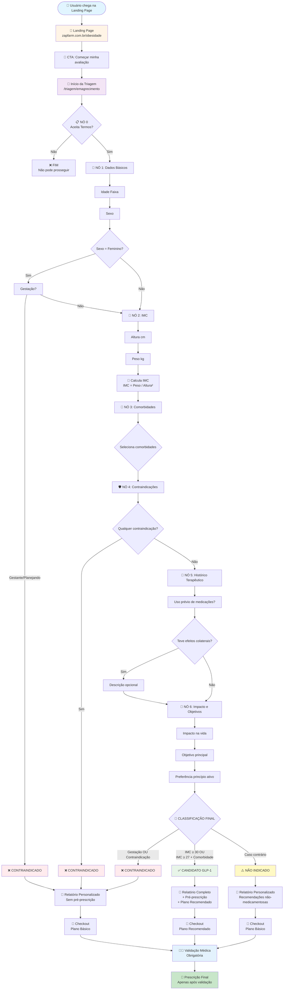
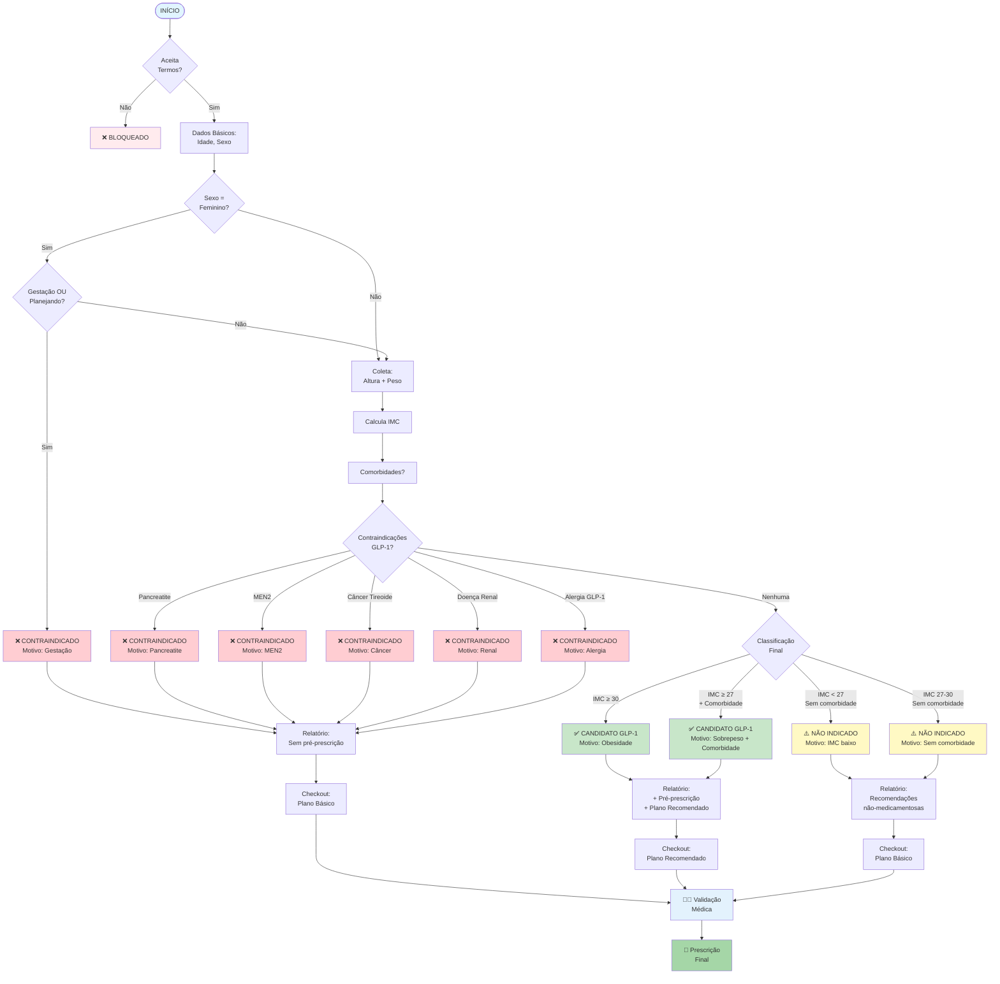
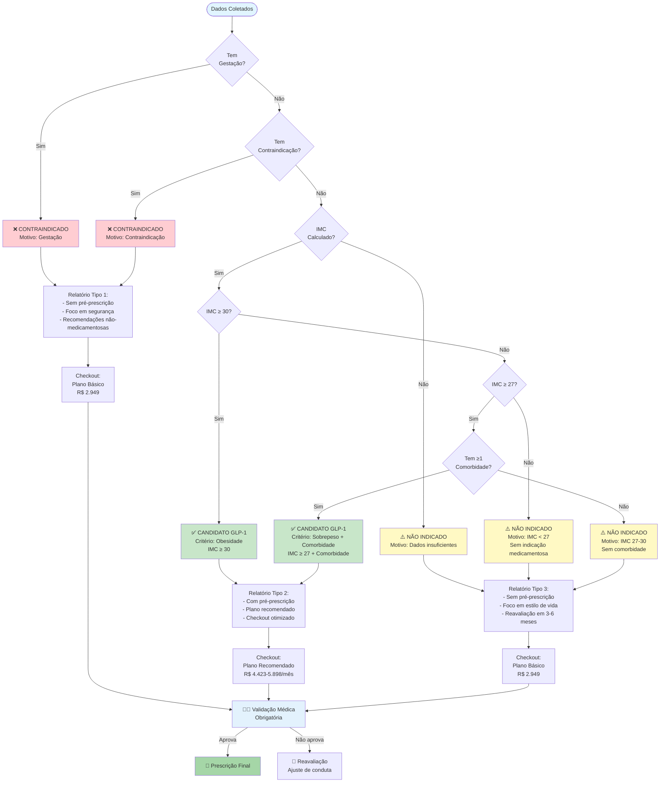
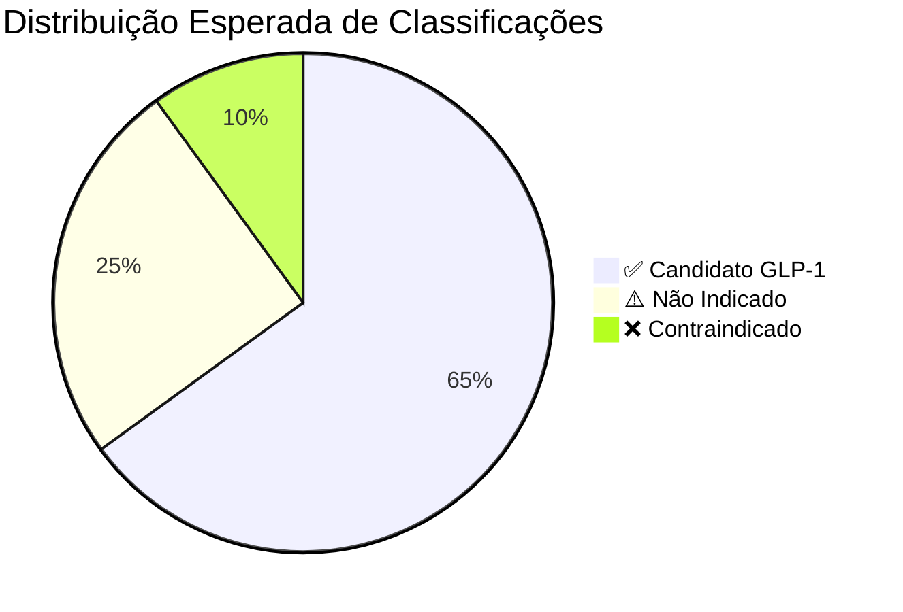

# 🎯 FLUXOGRAMA COMPLETO DA TRIAGEM DE EMAGRECIMENTO
## Documento Exclusivo para Apresentação a Investidores

**Data:** Janeiro 2025  
**Versão:** 1.0  
**Foco:** Triagem Inteligente de Emagrecimento

---

## 📋 COMO VISUALIZAR ESTES FLUXOGRAMAS

### **Opção 1: Mermaid Live Editor (RECOMENDADO)** ⭐
1. Acesse: **https://mermaid.live**
2. Cole o código do fluxograma desejado
3. Visualize em tempo real
4. Exporte como PNG/SVG para usar no Word/PowerPoint

### **Opção 2: GitHub**
- GitHub renderiza Mermaid automaticamente
- Basta abrir o arquivo `.md` no GitHub

### **Opção 3: VS Code**
- Instale extensão "Markdown Preview Mermaid Support"
- Visualize diretamente no editor

### **Opção 4: Word/PowerPoint**
1. Use Mermaid Live Editor para gerar imagem
2. Exporte como PNG (alta resolução)
3. Insira no documento

---

## 🎨 FLUXOGRAMA 1: VISÃO GERAL DA TRIAGEM

---

## 🌳 FLUXOGRAMA 2: ÁRVORE DE DECISÃO COMPLETA

---

## 🔀 FLUXOGRAMA 3: TODOS OS CAMINHOS POSSÍVEIS

```mermaid
flowchart LR
    Start([INÍCIO]) --> P1[Pergunta 1:<br/>Termos]
    
    P1 -->|Aceita| P2[Pergunta 2:<br/>Idade]
    P1 -->|Não aceita| Fim1[❌ FIM]
    
    P2 --> P3[Pergunta 3:<br/>Sexo]
    
    P3 -->|Masculino| P4a[Pergunta 4:<br/>Altura]
    P3 -->|Feminino| P3b[Pergunta 3b:<br/>Gestação]
    P3 -->|Outro| P4a
    
    P3b -->|Gestante| Contra1[❌ CONTRAINDICADO]
    P3b -->|Planejando| Contra1
    P3b -->|Não| P4a
    
    P4a --> P5[Pergunta 5:<br/>Peso]
    
    P5 --> Calc[Calcula IMC]
    
    Calc --> P6[Pergunta 6:<br/>Comorbidades]
    
    P6 --> P7[Pergunta 7:<br/>Contraindicações]
    
    P7 -->|Pancreatite| Contra2[❌ CONTRAINDICADO]
    P7 -->|MEN2| Contra3[❌ CONTRAINDICADO]
    P7 -->|Câncer| Contra4[❌ CONTRAINDICADO]
    P7 -->|Renal| Contra5[❌ CONTRAINDICADO]
    P7 -->|Alergia| Contra6[❌ CONTRAINDICADO]
    P7 -->|Nenhuma| P8
    
    P8[Pergunta 8:<br/>Histórico] --> P9[Pergunta 9:<br/>Efeitos Colaterais]
    
    P9 --> P10[Pergunta 10:<br/>Impacto Vida]
    P10 --> P11[Pergunta 11:<br/>Objetivo]
    P11 --> P12[Pergunta 12:<br/>Preferência]
    
    P12 --> Class{Classificação}
    
    Class -->|IMC ≥ 30| C1[✅ CANDIDATO]
    Class -->|IMC ≥ 27<br/>+ Comorb| C2[✅ CANDIDATO]
    Class -->|Outros| N1[⚠️ NÃO INDICADO]
    
    Contra1 --> R1[Relatório<br/>Contraindicado]
    Contra2 --> R1
    Contra3 --> R1
    Contra4 --> R1
    Contra5 --> R1
    Contra6 --> R1
    
    C1 --> R2[Relatório<br/>Candidato]
    C2 --> R2
    
    N1 --> R3[Relatório<br/>Não Indicado]
    
    R1 --> Checkout1[Checkout]
    R2 --> Checkout2[Checkout]
    R3 --> Checkout3[Checkout]
    
    Checkout1 --> Medico[Validação<br/>Médica]
    Checkout2 --> Medico
    Checkout3 --> Medico
    
    Medico --> Prescricao[Prescrição]
    
    style Start fill:#e1f5ff
    style Fim1 fill:#ffebee
    style Contra1 fill:#ffcdd2
    style Contra2 fill:#ffcdd2
    style Contra3 fill:#ffcdd2
    style Contra4 fill:#ffcdd2
    style Contra5 fill:#ffcdd2
    style Contra6 fill:#ffcdd2
    style C1 fill:#c8e6c9
    style C2 fill:#c8e6c9
    style N1 fill:#fff9c4
    style Medico fill:#e3f2fd
    style Prescricao fill:#a5d6a7
```

---

## 📊 FLUXOGRAMA 4: LÓGICA DE CLASSIFICAÇÃO DETALHADA

---

## 🎯 FLUXOGRAMA 5: PERGUNTAS E CONDIÇÕES

```mermaid
flowchart TD
    Q0[Q0: Aceita Termos?<br/>Tipo: Select<br/>Obrigatório: Sim] -->|Sim| Q1
    
    Q1[Q1: Idade Faixa<br/>Tipo: Select<br/>Opções: 18-30, 31-45, 46-60, 61+]
    Q1 --> Q2
    
    Q2[Q2: Sexo<br/>Tipo: Select<br/>Opções: M, F, Outro, Prefiro não dizer]
    Q2 --> Cond1{Sexo =<br/>Feminino?}
    
    Cond1 -->|Sim| Q3[Q3: Gestação<br/>Tipo: Select<br/>Condicional: Sexo = F<br/>Opções: Não, Sim grávida, Planejando]
    Cond1 -->|Não| Q4
    
    Q3 -->|Gestante/Planejando| Contra[❌ CONTRAINDICADO]
    Q3 -->|Não| Q4
    
    Q4[Q4: Altura<br/>Tipo: Input numérico<br/>Unidade: cm]
    Q4 --> Q5
    
    Q5[Q5: Peso<br/>Tipo: Input numérico<br/>Unidade: kg]
    Q5 --> Calc[Calcula IMC]
    
    Calc --> Q6[Q6: Comorbidades<br/>Tipo: Multiselect<br/>Opções: Diabetes, Pré-diabetes,<br/>Hipertensão, Dislipidemia,<br/>Apneia, Artrose, Depressão,<br/>Nenhuma]
    
    Q6 --> Q7[Q7: Info Contraindicações<br/>Tipo: Info<br/>Educacional]
    Q7 --> Q8
    
    Q8[Q8: Contraindicações GLP-1<br/>Tipo: Multiselect<br/>Opções: Pancreatite, MEN2,<br/>Câncer tireoide, Doença renal,<br/>Alergia GLP-1, Nenhuma]
    
    Q8 --> Cond2{Qualquer<br/>contraindicação?}
    Cond2 -->|Sim| Contra2[❌ CONTRAINDICADO]
    Cond2 -->|Não| Q9
    
    Q9[Q9: Histórico Medicamentos<br/>Tipo: Multiselect<br/>Opções: Injetáveis semanais,<br/>Orais emagrecimento,<br/>Nunca usei]
    
    Q9 --> Cond3{Já usou<br/>medicação?}
    Cond3 -->|Sim| Q10[Q10: Efeitos Colaterais<br/>Tipo: Select<br/>Condicional: Q9 ≠ Nunca<br/>Opções: Parou, Continuou,<br/>Não teve, N/A]
    Cond3 -->|Não| Q11
    
    Q10 --> Q10b[Q10b: Descrição Opcional<br/>Tipo: Textarea<br/>Opcional]
    Q10b --> Q11
    
    Q11[Q11: Impacto Vida<br/>Tipo: Select<br/>Opções: Muito, Moderado,<br/>Pouco, Nenhum]
    Q11 --> Q12
    
    Q12[Q12: Objetivo Principal<br/>Tipo: Select<br/>Opções: Perder peso,<br/>Melhorar saúde metabólica,<br/>Ambos, Outro]
    Q12 --> Q13
    
    Q13[Q13: Preferência Princípio Ativo<br/>Tipo: Select Cards<br/>Opções: Tirzepatida,<br/>Semaglutida, Médico escolhe]
    
    Q13 --> Classificacao[🧠 CLASSIFICAÇÃO FINAL]
    
    Contra --> Fim1[FIM: Contraindicado]
    Contra2 --> Fim1
    
    Classificacao -->|IMC ≥ 30| Fim2[FIM: Candidato GLP-1]
    Classificacao -->|IMC ≥ 27 + Comorb| Fim2
    Classificacao -->|Outros| Fim3[FIM: Não Indicado]
    
    style Q0 fill:#fff4e6
    style Q1 fill:#fff4e6
    style Q2 fill:#fff4e6
    style Q3 fill:#ffebee
    style Q4 fill:#e3f2fd
    style Q5 fill:#e3f2fd
    style Q6 fill:#f3e5f5
    style Q7 fill:#fff9c4
    style Q8 fill:#ffebee
    style Q9 fill:#e8f5e9
    style Q10 fill:#e8f5e9
    style Q11 fill:#e1f5ff
    style Q12 fill:#e1f5ff
    style Q13 fill:#f3e5f5
    style Contra fill:#ffcdd2
    style Contra2 fill:#ffcdd2
    style Fim1 fill:#ffcdd2
    style Fim2 fill:#c8e6c9
    style Fim3 fill:#fff9c4
```

---

## 📈 FLUXOGRAMA 6: DISTRIBUIÇÃO DE RESULTADOS

---

## 💡 EXPLICAÇÕES PARA INVESTIDORES

### **1. Por que este fluxo é inteligente?**

✅ **Validação em Tempo Real**
- Cada resposta valida dados anteriores
- Perguntas condicionais evitam perguntas irrelevantes
- Cálculo automático de IMC e classificação

✅ **Segurança Clínica**
- Identifica contraindicações ANTES de qualquer recomendação
- Gestação detectada imediatamente
- Alerta médico automático para casos críticos

✅ **Personalização Inteligente**
- Relatório adaptado ao perfil específico
- Plano recomendado baseado em classificação
- Checkout otimizado por perfil

### **2. Taxa de Conversão por Classificação**

| Classificação | Taxa Esperada | Valor Médio |
|--------------|---------------|-------------|
| ✅ Candidato GLP-1 | 15-25% | R$ 4.423-5.898/mês |
| ⚠️ Não Indicado | 3-8% | R$ 2.949 (único) |
| ❌ Contraindicado | 5-10% | R$ 2.949 (único) |

**Taxa Média Geral:** 12-18%

### **3. Pontos de Diferenciação**

🎯 **Inteligência Artificial Especializada**
- IA configurada como endocrinologista especialista em obesidade
- Prompts baseados em diretrizes atuais
- Relatórios individualizados e personalizados

🛡️ **Segurança em Primeiro Lugar**
- Validação médica obrigatória ANTES de prescrição
- Pré-prescrição é apenas sugestão
- Médico tem poder de veto total

📊 **Dados Estruturados**
- Todas as respostas são salvas e auditáveis
- Rastreabilidade completa do processo
- Base para machine learning futuro

### **4. Escalabilidade**

✅ **Processo Automatizado**
- 15 perguntas em ~5-7 minutos
- Geração de relatório em <30 segundos (assíncrono)
- Zero intervenção manual necessária

✅ **Validação Médica Escalável**
- Médico valida múltiplos casos por hora
- Interface otimizada para revisão rápida
- Aprovação/rejeição em <2 minutos

---

## 📋 RESUMO EXECUTIVO

### **O que este fluxograma mostra:**

1. **Jornada Completa:** Do primeiro clique até a prescrição final
2. **Decisões Inteligentes:** Cada pergunta leva a um caminho específico
3. **Segurança:** Múltiplas camadas de validação
4. **Personalização:** Cada usuário recebe um relatório único
5. **Conversão:** Otimização em cada etapa do funil

### **Métricas Esperadas:**

- **Tempo médio de triagem:** 5-7 minutos
- **Taxa de conclusão:** 70-80%
- **Taxa de conversão geral:** 12-18%
- **Valor médio por conversão:** R$ 3.500-4.500

### **Diferenciais Competitivos:**

1. ✅ IA especializada (não genérica)
2. ✅ Validação médica obrigatória
3. ✅ Fluxo otimizado para conversão
4. ✅ Segurança clínica em primeiro lugar
5. ✅ Escalabilidade automática

---

## 🎯 PRÓXIMOS PASSOS

1. **Visualizar fluxogramas:** Use Mermaid Live Editor (mermaid.live)
2. **Exportar imagens:** Para usar em Word/PowerPoint
3. **Apresentar:** Use este documento como base
4. **Personalizar:** Adapte explicações ao seu público

---

**Documento criado em:** Janeiro 2025  
**Versão:** 1.0  
**Status:** ✅ Pronto para apresentação

